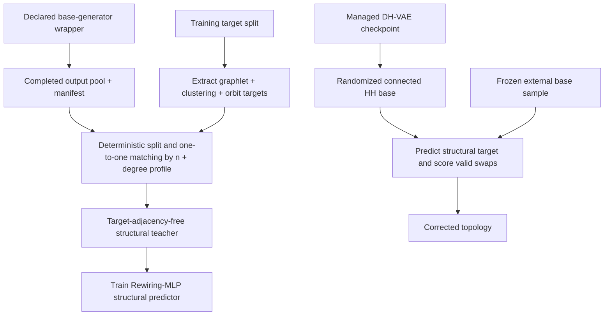

# GraphER: Decoupled Topology Generation and Post-Correction

GraphER is a constraint-preserving graph generator/refiner. The maintained
generic implementation treats the Rewiring MLP as a model-agnostic structural
corrector: it starts from a **completed graph produced by a declared base
generator**, predicts graph-level structural targets, and applies valid
double-edge swaps without changing the base graph's indexed degree sequence.

The current generic target vector is

\[
\Phi(G)=\bigl(H_{3:5}(G),\ C(G),\ O_{0:14}(G)\bigr),
\]

where \(H_{3:5}\) contains connected induced graphlet histograms, \(C\) is a
clustering-coefficient histogram, and \(O_{0:14}\) is the standard
15-dimensional mean orbit-count vector for connected graphlets with two to
four nodes. The active topology model has no terminal adjacency, edge/no-edge,
node-label, or edge-label prediction head.

## Current scope

The intended topology-attribute factorization remains

\[
p(A,X,R)=p_{\mathrm{top}}(A)\,p_{\mathrm{attr}}(X,R\mid A),
\]

where \(A\) is the unlabelled topology, \(X\) contains node attributes, and
\(R\) contains edge attributes. This release implements generic topology
correction and from-scratch topology generation:

- DH-VAE + randomized connected Havel--Hakimi is the maintained optional
  from-scratch base;
- DeFoG is the maintained external frozen base;
- the Rewiring MLP is trained from each base's completed post-training output
  pool, not from an implicit Havel--Hakimi reconstruction of the target; and
- target graphs supply permutation-invariant graphlet, clustering, and orbit
  summaries only.

| Route | Status | Active implementation |
| --- | --- | --- |
| Generic from-scratch topology | Current | declared DH-VAE+HH base + structural-summary GraphER |
| Generic post-hoc correction | Current | declared frozen DeFoG base + base-matched structural-summary GraphER |
| Attributed endpoint model | Legacy compatibility | existing QM9/ZINC code under `grapher.rewiring_mlp.attributed` |
| Decoupled attribute stage | Planned | attribute-only CatFlow/DeFoG-style process conditioned on generated topology |

The base generator and Rewiring MLP are optimized separately. A corrector
checkpoint is base-specific unless its `training_sources.generators` list
explicitly contains multiple generators. End-to-end joint optimization is not
implemented.

## Baseline model wrappers

The post-generation evaluation requires every frozen base generator to expose
the same GraphER-facing interface. The new `grapher.models` package registers
wrappers for DH-VAE + randomized Havel--Hakimi, DiGress, CatFlow, DeFoG,
HOG-Diff, and FLAGG. Each wrapper has the common methods:

```python
train(request: TrainRequest) -> TrainingArtifacts
generate(request: GenerateRequest) -> GenerationArtifacts
```

The wrapper layer also defines the training-source contract for the Rewiring
MLP. A completed wrapper publishes a checksum-verified post-training output
pool; `train_topology_grapher.py` resolves that manifest, creates a deterministic
train/validation partition, and explicitly couples source graphs to training
targets. Candidate swaps and hard validity constraints remain independent of
the base implementation.

Wrappers are located in `src/grapher/models/`, rather than a top-level
`src/models/`, so that GraphER remains namespaced and does not shadow external
repositories that use imports such as `models.*`. The package contains adapters
for third-party baselines and the complete project-owned DH-VAE+HH baseline.
Third-party model code remains in its own pinned repository and environment.

| Wrapper ID | Model | Wrapper status | Intended backend |
| --- | --- | --- | --- |
| `dhvae_hh` | DH-VAE + randomized HH | Ready: generic, QM9, and ZINC | Project-owned trainer, invariant sampler, and exact constructor |
| `digress` | DiGress | Placeholder | Isolated external repository |
| `catflow` | CatFlow | Placeholder | Isolated external repository |
| `defog` | DeFoG | Ready: generic, QM9, and ZINC | Isolated training plus schema-validated neutral-NPZ generation |
| `hog_diff` | HOG-Diff | Placeholder | Isolated external repository |
| `flagg` | FLAGG | Placeholder | Isolated external repository with recorded filler configuration |

Unimplemented third-party integrations raise `BaselineNotImplementedError`
before creating partial artifacts. The DH-VAE, samplers, HH constructors,
trainer, diagnostics, and ready common wrapper live together under
`grapher.models.dhvae_hh`; the existing training/evaluation CLI paths remain
as compatibility entry points.

Baseline outputs use a single collision-resistant layout:

```text
outputs/baselines/<model>/<dataset>/<training-run>/
├── run.json
├── train/
│   ├── manifest.json
│   ├── resolved_config.yaml
│   ├── train.log
│   ├── native_dataset/
│   ├── training_estimates/
│   │   ├── estimated_graphs.pkl
│   │   ├── ground_truth_graphs.pkl
│   │   ├── ground_truth_model_view.pkl  # molecular runs when required
│   │   ├── manifest.json
│   │   └── native/
│   └── checkpoints/
└── generations/<generation-run>/
    ├── base_graphs.pkl
    ├── manifest.json
    ├── generate.log
    └── native/
```

Training and generation seeds are distinct. The default identifiers are
`seed_<training-seed>` and `seed_<generation-seed>_n_<sample-count>`, so several
raw batches can be generated from one checkpoint without overwriting each
other. GraphER-corrected graphs belong under a separate `outputs/corrections/`
tree and must reference the raw batch hash and order in their manifest.

Dataset references distinguish the benchmark name, GraphER serialized name,
and upstream-native alias. For example, Community-small may be represented by
`community_small` in reports, `sbm` in the current prepared-data directory, and
`comm20` in DeFoG. The report-facing benchmark name is always used in the
baseline artifact path.

The complete API, manifest requirements, and implementation checklist are in
[`docs/BASELINE_MODEL_WRAPPERS.md`](docs/BASELINE_MODEL_WRAPPERS.md).
The DeFoG-specific setup, training-estimate semantics, and examples are in
[`docs/DEFOG_WRAPPER.md`](docs/DEFOG_WRAPPER.md).

To train DH-VAE+HH on Community-small and generate 1,024 raw graphs:

```bash
PYTHONPATH=src python scripts/run_dhvae_hh_baseline.py \
  --dataset community_small \
  --num-samples 1024 \
  --seed-id 42
```

The command trains the DH-VAE from `outputs/datasets/sbm`, realizes sampled
degree sequences with the existing randomized connected HH constructor, and
writes the raw batch to
`outputs/baselines/dhvae_hh/community_small/seed_42/generations/seed_42_n_1024/base_graphs.pkl`.
The post-training estimate pool is an independent unconditional sample, so its
manifest records `pairing.status: unpaired`; equal source/target counts never
imply index alignment. Rewiring-MLP training performs a separate deterministic
one-to-one coupling within exact node-count strata using Hungarian assignment
on the normalized sorted-degree profile. Clustering, orbit, and graphlet
summaries are explicitly excluded from the matching cost and remain held-out
prediction targets.

To train DeFoG on the prepared Community-small split and then generate 1,024
raw graphs, keep GraphER in its own environment and point the wrapper at the
isolated DeFoG interpreter:

```bash
export DEFOG=/home/quang/DeFoG
export DEFOG_PYTHON=/home/quang/miniconda3/envs/defog/bin/python

PYTHONPATH=src python scripts/run_defog_baseline.py \
  --dataset community_small \
  --num-samples 1024 \
  --seed-id 42
```

The runner now writes stage transitions, DeFoG subprocess output, epoch-level
training updates, periodic liveness heartbeats, and completed generation-batch
counts to stderr. The final artifact summary remains the only stdout payload,
so it can still be redirected as JSON. Use
`--no-stream-subprocess-output` to keep only the stable stage/heartbeat lines,
or change their cadence with `--progress-interval-seconds`. For DeFoG
experiments with very large epoch horizons, `--epoch-progress-interval N`
controls the explicit epoch summaries.

For a one-GPU run, the training worker replaces DeFoG's hard-coded DDP strategy
with Lightning's single-device strategy, so NCCL is not initialized merely to
train on one device. The worker prints its effective strategy and writes
`train/runtime_diagnostics.json`. If training fails, the complete log,
diagnostics, Hydra configuration, command, and failure classification remain
under `outputs/baselines/defog/<dataset>/<run-id>/failures/attempt-*/` even
after the temporary staging directory is removed.

## Design overview



### Degree-constrained state space

For a completed source graph \(G_0\), GraphER stays inside its indexed degree
fibre

\[
\Omega(d^{(0)})=
\left\{
G:
G\text{ is simple and connected, and }
d_v(G)=d_v(G_0)\ \forall v
\right\}.
\]

A valid double-edge swap selects two edges with four distinct endpoints and
replaces them by one of the two cross-connections. Before scoring, GraphER
rejects actions that introduce a self-loop, duplicate edge, disconnected
state, or previously visited state.

Every accepted action therefore preserves node and edge counts, every indexed
node degree, the degree multiset, simplicity, undirectedness, and connectivity.
These are hard guarantees of the transition operator, not learned penalties.

### Structural-summary targets

For each maintained graphlet size \(k\in\{3,4,5\}\), the implementation uses
the complete basis of connected, unlabelled, induced graphlets. If \(c_H(G)\)
is the number of induced occurrences of graphlet \(H\), the per-size
composition is

\[
h_k(G)_H=
\frac{c_H(G)}{\sum_{J\in\mathcal K_k}c_J(G)}.
\]

The optional connected-subset mass is

\[
\rho_k(G)=
\frac{\sum_{H\in\mathcal K_k}c_H(G)}{\binom{|V|}{k}}.
\]

The clustering target is a normalized histogram of node clustering
coefficients on `[0,1]`; maintained configurations use 20 bins. The orbit
target is the mean per-node count for the standard ORCA-style orbits 0--14.
Because these orbits are determined by the edge count and connected induced
three- and four-node graphlet counts, the implementation derives them from the
same exact cache rather than invoking ORCA during training.

Graphlet counts are exact. Candidate graphlet and orbit counts are obtained
with exact switch-local deltas over subsets affected by removed or inserted
edges. Clustering is recomputed for the materialized candidate. The
`graphlet_backend: sampled` field in maintained YAML files applies to external
evaluation, not to predictor targets or candidate scoring.

### State-conditioned predictor

`TopologyGraphletPredictor` is retained as the compatibility class name, but
checkpoint format `topology_structural_predictor_v2` contains three active
heads. The model consumes the current binary adjacency, normalized indexed
node degrees, graph size, normalized rewiring time `t/T`, and padding masks. It
outputs:

- one Dirichlet concentration vector \(\alpha_{t,k}\) per graphlet size;
- an optional Beta pair for each connected-subset mass;
- one Dirichlet concentration vector \(\gamma_t\) for clustering; and
- a non-negative prediction of \(\log(1+O_{0:14})\).

\[
\widehat h_{t,k}=\frac{\alpha_{t,k}}{\sum_j\alpha_{t,k,j}},
\qquad
\widehat C_t=\frac{\gamma_t}{\sum_j\gamma_{t,j}}.
\]

The graph-level outputs are permutation invariant. The model has no terminal
node head, pair/edge head, no-edge class, pair loss, degree-consistency loss, or
learned selector. Dense symmetric pair features are used internally, so the
current encoder still has \(O(n^2)\) pair memory/computation.

The maintained objective is

\[
\mathcal L=
\lambda_{g,m}\,\mathrm{CE}(H^\star,\widehat H)
+\lambda_{g,d}\,[-\log\mathrm{Dir}(H^\star;\alpha)]
+\lambda_{c,m}\,\mathrm{CE}(C^\star,\widehat C)
+\lambda_{c,d}\,[-\log\mathrm{Dir}(C^\star;\gamma)]
+\lambda_o\,\mathrm{SmoothL1}
  \bigl(\log(1+O^\star),\widehat L_o\bigr),
\]

plus the optional graphlet connected-mass term. Maintained configurations use
`graphlet_mean: 1.0`, `graphlet_distribution: 0.1`,
`clustering_mean: 1.0`, `clustering_distribution: 0.1`, `orbit: 1.0`, and
`graphlet_mass: 0.0`.

### Completed-base matching and teacher trajectories

For each declared base generator and each split, training:

1. loads the wrapper's completed graph pool and verifies its published SHA-256;
2. drops or errors on disconnected sources according to the declared policy;
3. partitions that pool deterministically into training and validation sources;
4. forms exact node-count strata and solves a one-to-one Hungarian assignment
   using only normalized sorted-degree-profile distance;
5. extracts graphlet, clustering, and orbit targets from the matched dataset
   graph; and
6. starts the teacher trajectory from the **unchanged completed source output**
   (`source_randomization_steps: 0`; optional random relabelling changes indices
   only).

The target adjacency is never supplied to the predictor or candidate proposer.
The same cached graph-level target supervises all selected states from a
trajectory. The source and target need not have identical degrees; every
teacher state remains in the source graph's degree fibre, while degree-profile
matching reduces avoidable incompatibility. Pairing retention, costs, strata,
source hashes, and excluded matching features are written to
`training_report.json`.

### Generation and correction energy

At step \(t\), one predicted target is frozen while all proposed candidates are
compared:

\[
\widehat E_t(G)=
\lambda_g D_g(H(G),\widehat H_t)
+\lambda_c\frac{\|C(G)-\widehat C_t\|_2}{\sqrt{B}}
+\lambda_o\frac{\|\log(1+O(G))-\log(1+\widehat O_t)\|_2}{\sqrt{15}}
+\lambda_m D_m(\rho(G),\widehat\rho_t).
\]

For candidate action \(a\),

\[
\Delta_t(a)=\widehat E_t(G_t)-\widehat E_t(T_a(G_t)).
\]

Only candidates with \(\Delta_t(a)>\varepsilon\) can be accepted. The
maintained greedy configuration chooses the best improving candidate and
recomputes all predicted summaries after every accepted swap. This gives a
step-local decrease guarantee for the frozen prediction used in that decision;
it does not imply global monotonicity, exact target recovery, or convergence to
the data distribution.

## Repository layout

```text
configs/
  datasets/                    Generic and molecular dataset definitions
  experiments/dhvae/           Degree-prior training configurations
  experiments/grapher/         Topology and retained attributed configurations
docs/
  DHVAE_HH_PACKAGE.md          DH-VAE+HH isolation boundary and migration map
  TOPOLOGY_GENERATOR.md        Detailed topology data flow and guarantees
  DESIGN_CONTRACT.md           Proposal-to-implementation contract
scripts/
  defog_export_worker.py
  defog_prepare_dataset_worker.py
  defog_prepare_molecular_dataset_worker.py
  defog_molecular_runtime.py
  defog_train_worker.py
  prepare_generic_dataset.py
  train_degree_generator.py
  evaluate_degree_generator.py
  train_topology_grapher.py
  run_topology_grapher.py
  run_defog_grapher.py
  evaluate_graph_generation_report.py
src/grapher/rewiring_mlp/       Rewiring MLP implementation and support code
  generic/                      Generic structural-summary corrector
  attributed/                   Attribute-aware corrector
  core/                         Shared degree-preserving swap operations
  molecular/                    Molecular constraints and typed invariants
  evaluation/                   Raw/corrected metrics and study utilities
src/grapher/models/dhvae_hh/    DH-VAE, samplers, HH constructors, and CLIs
src/grapher/models/defog.py     Common DeFoG train/generate wrapper
src/grapher/models/defog_backend.py
                                Isolated subprocess and neutral-export boundary
src/grapher/models/defog_molecular_codec.py
                                Strict QM9/ZINC semantic graph codec
tests/                          Generic and retained legacy regression tests
```

## Environment setup

Python 3.10 or newer is required. This archive does not contain packaging
metadata, so run it with `PYTHONPATH=src` and install dependencies directly.

```bash
python3 -m venv .venv
source .venv/bin/activate
python -m pip install --upgrade pip

# Install a CUDA-specific PyTorch build instead when required by your machine.
python -m pip install torch
python -m pip install numpy networkx pyyaml matplotlib

# Development and verification tools.
python -m pip install pytest ruff
```

Optional dependencies:

- ORCA: exact external four-node orbit evaluation.
- RDKit, PyG, and `fcd-torch`: retained molecular workflows only.

Run every command below from the repository root.

## End-to-end quick start: Community-small

Run every command from the repository root.

### 1. Prepare and freeze the dataset

```bash
PYTHONPATH=src python scripts/prepare_generic_dataset.py \
  --dataset community_small \
  --root outputs/datasets
```

Community-small intentionally retains the historical serialized name `sbm`;
its split files are written to `outputs/datasets/sbm/`.

### 2. Train the declared DH-VAE+HH base and publish completed outputs

```bash
PYTHONPATH=src python scripts/run_dhvae_hh_baseline.py \
  --dataset community_small \
  --num-samples 1024 \
  --training-estimate-count 1024 \
  --seed-id 42 \
  --device gpu
```

This single managed run publishes both artifacts required by the maintained
configuration:

```text
outputs/baselines/dhvae_hh/community_small/seed_42/train/
├── checkpoints/checkpoint.pt
└── training_estimates/manifest.json
```

The manifest points to completed randomized-HH graphs sampled from the trained
DH-VAE. They are unconditional outputs and therefore deliberately unpaired.

### 3. Train the Rewiring MLP

```bash
PYTHONPATH=src python scripts/train_topology_grapher.py \
  --config configs/experiments/grapher/community_small_topology_graphlet.yaml \
  --output-dir outputs/topology_grapher/community_small/seed_42 \
  --seed 42 \
  --device gpu
```

Despite the historical config filename, this trains the v2 structural
predictor with graphlet, clustering, and orbit targets. Before building teacher
states, the script loads the declared completed source pool, verifies its
checksum, partitions it deterministically, and writes the one-to-one matching
audit to `training_report.json`. It fails rather than silently reverting to an
implicit Havel--Hakimi training source.

A small integration run can be launched with:

```bash
PYTHONPATH=src python scripts/train_topology_grapher.py \
  --config configs/experiments/grapher/community_small_topology_graphlet.yaml \
  --output-dir outputs/topology_grapher/community_small/smoke_seed_42 \
  --max-train-graphs 8 \
  --max-val-graphs 4 \
  --epochs 1 \
  --seed 42 \
  --device cpu
```

The completed source pool must still contain matching node-count strata for the
selected target subset.

### 4. Generate and refine graph topologies

```bash
 PYTHONPATH=src python scripts/run_topology_grapher.py \
  --config configs/experiments/grapher/community_small_topology_graphlet.yaml \
  --output-dir outputs/topology_generation/community_small/seed_42 \
  --num-generate 1024 \
  --seed 42 \
  --device auto
```

The maintained topology config points to the same managed DH-VAE checkpoint
that produced the Rewiring-MLP training sources. Generation fails early if the
base or corrector checkpoint is missing or incompatible. The base topology
config uses the closed-loop `K=1` prediction-refresh baseline. Adaptive/fixed
prediction horizons are generation-only and can be supplied without cloning a
YAML file via repeatable `--set KEY=VALUE` arguments, for example:

```bash
PYTHONPATH=src python scripts/run_topology_grapher.py \
  --config configs/experiments/grapher/community_small_topology_graphlet.yaml \
  --output-dir outputs/topology_generation/community_small/k2/seed_42 \
  --num-generate 1024 \
  --seed 42 \
  --device gpu \
  --set topology_refiner.prediction_horizon.mode=fixed \
  --set topology_refiner.prediction_horizon.k=2 \
  --set topology_refiner.prediction_horizon.refresh_on_plateau=true
```

A reproducibility config for the annealed variant is also provided at
`configs/experiments/grapher/community_small_topology_graphlet_adaptive_k.yaml`.
Training does not use this horizon block; teacher trajectories always advance
one accepted rewiring action per step.

### 5. Evaluate saved graphs

```bash
PYTHONPATH=src python scripts/evaluate_graph_generation_report.py \
  --config configs/experiments/grapher/community_small_topology_graphlet.yaml \
  --generated-dir outputs/topology_generation/community_small/seed_42 \
  --output-dir outputs/topology_grapher/community_small/seed_42/evaluation
```

The report compares the completed DH-VAE+HH base and corrected graphs against
the held-out split using degree, clustering, orbit, and configured graphlet
metrics.

## Prepare report-facing molecular datasets

Canonical QM9 preparation requires the original `gdb9.sdf` and the official
`uncharacterized.txt` distributed with QM9. The command verifies 133,885 source
records, excludes exactly 3,054 declared uncharacterized records, audits
unsupported charge/stereo state, and writes the fixed 130,831-molecule split:

```bash
PYTHONPATH=src python scripts/prepare_qm9_dataset.py \
  --config configs/datasets/qm9.yaml \
  --source sdf \
  --sdf-file data/qm9/gdb9.sdf \
  --uncharacterized-file data/qm9/uncharacterized.txt \
  --root outputs/datasets
```

Prepare the fixed ZINC-12k subset from a local ZINC250k SMILES table. This
protocol retains aromatic source bonds, rejects unsupported charged atoms, and
records source and selected-record hashes:

```bash
PYTHONPATH=src python scripts/prepare_zinc_dataset.py \
  --config configs/datasets/zinc.yaml \
  --smiles-file data/zinc250k.csv \
  --smiles-column smiles \
  --root outputs/datasets
```

Both commands print the same preparation-summary schema and write immutable
`train.pkl`, `val.pkl`, and `test.pkl` artifacts plus resolved configuration
and machine-readable preparation reports.

## DeFoG base + GraphER correction

DeFoG remains isolated in its own environment. Set its repository and
interpreter, then train it through the common wrapper so a completed
post-training output pool is published:

```bash
export DEFOG=/home/quang/DeFoG
export DEFOG_PYTHON=/home/quang/miniconda3/envs/defog/bin/python

PYTHONPATH=src python scripts/run_defog_baseline.py \
  --dataset community_small \
  --num-samples 1024 \
  --seed-id 42
```

Train a DeFoG-specific Rewiring MLP from that pool:

```bash
PYTHONPATH=src python scripts/train_topology_grapher.py \
  --config configs/experiments/grapher/community_small_defog_rewiring_mlp.yaml \
  --output-dir outputs/topology_grapher/community_small_defog/seed_42 \
  --seed 42 \
  --device auto
```

Then generate a new DeFoG batch and correct it with the matching checkpoint:

```bash
PYTHONPATH=src python scripts/run_defog_grapher.py \
  --config configs/experiments/grapher/community_small_defog_corrector.yaml \
  --defog-checkpoint outputs/baselines/defog/community_small/seed_42/train/checkpoints/model.ckpt \
  --checkpoint outputs/topology_grapher/community_small_defog/seed_42/checkpoint.pt \
  --output-dir outputs/defog_grapher/community_small/seed_42 \
  --num-generate 1024 \
  --seed 42
```

The child calls DeFoG's `GraphDiscreteFlowModel.sample_batch()` directly; it
does not invoke DeFoG's test-metric or visualization path. Samples are exported
as numeric `defog_samples.npz` arrays with `allow_pickle=False` and decoded
according to the recorded schema.

To reuse identical DeFoG samples across correction ablations, set
`base_generator.generated_path` or pass `--defog-generated` with a previous
neutral NPZ. Disconnected samples are retained unchanged under
`disconnected_policy: no_op_and_report`; they are not dropped, repaired, or
replaced. The report records the raw base order, correction eligibility,
structural gains, invariant preservation, and runtime.

Evaluate the paired source/final sets with:

```bash
PYTHONPATH=src python scripts/evaluate_graph_generation_report.py \
  --config configs/experiments/grapher/community_small_defog_corrector.yaml \
  --generated-dir outputs/defog_grapher/community_small/seed_42
```

A released DeFoG `comm20` checkpoint may use DeFoG's own SPECTRE split. The
wrapper and corrector reports preserve this provenance; an identical GraphER
training split must not be claimed unless DeFoG was retrained on it.

## Other generic datasets

Use the same prepare -> managed base -> Rewiring MLP -> generation workflow:

| Benchmark | Prepare with `--dataset` | Managed base command | Rewiring-MLP config | Managed base checkpoint |
| --- | --- | --- | --- | --- |
| Community-small | `community_small` | `run_dhvae_hh_baseline.py --dataset community_small` | `configs/experiments/grapher/community_small_topology_graphlet.yaml` | `outputs/baselines/dhvae_hh/community_small/seed_42/train/checkpoints/checkpoint.pt` |
| Ego-small | `ego_small` | `run_dhvae_hh_baseline.py --dataset ego_small` | `configs/experiments/grapher/ego_small_topology_graphlet.yaml` | `outputs/baselines/dhvae_hh/ego_small/seed_42/train/checkpoints/checkpoint.pt` |
| Grid | `grid` | `run_dhvae_hh_baseline.py --dataset grid` | `configs/experiments/grapher/grid_topology_graphlet.yaml` | `outputs/baselines/dhvae_hh/grid/seed_42/train/checkpoints/checkpoint.pt` |

Suggested corrector output roots are
`outputs/topology_grapher/<benchmark>/seed_42`. Grid uses
`topology_predictor.batch_size: 1` because exact structural extraction and
dense pair features are substantially more expensive for its larger graphs.

## Configuration reference

| Section | Purpose | Important maintained settings |
| --- | --- | --- |
| `pipeline` | Select active route | `stage: topology` or `posthoc_correction` |
| `dataset` | Frozen target/reference split | `build_if_missing: false` |
| `training_sources` | Completed base-output contract | declared manifests, exact-size strata, Hungarian degree-profile coupling |
| `graphlet_prediction` | Structural target schema | exact connected graphlets `k=3,4,5`, 20-bin clustering, 15 orbit counts |
| `topology_trajectory` | Teacher construction | completed source, zero source randomization, valid degree-preserving swaps |
| `topology_predictor` | Rewiring MLP and optimizer | graphlet + clustering + orbit losses, best validation checkpoint |
| `generation` | Requested yield | learned base prior or external frozen base |
| `degree_generator` | Managed DH-VAE loading | same wrapper run that published the source pool |
| `constructor` | From-scratch base realization | randomized connected Havel--Hakimi |
| `topology_refiner` | Candidate selection | combined structural energy, positive-gain gate, prediction refresh |
| `evaluation` | Saved-set metrics | degree/clustering/orbit/graphlet and audit fields |
| `base_generator` | External base | isolated DeFoG checkpoint/export and sampling settings |

### Degree-source ablations

`generation.degree_source` supports:

- `learned`: strict DH-VAE sampling; the maintained default;
- `empirical`: sample a degree sequence from the training distribution; and
- `oracle`: reuse held-out test degree sequences for diagnostic
  error decomposition only.

Oracle mode is not a generative result and must be labelled explicitly.

### Topology checkpoint contract

Topology checkpoints use format `topology_structural_predictor_v2` and include:

- model weights and architecture, including clustering/orbit head widths;
- the complete graphlet basis and coordinate order;
- structural-summary configuration;
- held-out graphlet, clustering, and orbit diagnostics;
- resolved experiment configuration; and
- the source-pool/matching report in the adjacent `training_report.json`.

Graphlet-only v1 and legacy endpoint checkpoints are intentionally rejected;
retraining is required because their output dimensions and semantics differ.

## Output files

| Stage | Default location | Files |
| --- | --- | --- |
| Dataset preparation | `outputs/datasets/<serialized-name>/` | `train.pkl`, `val.pkl`, `test.pkl`, `resolved_dataset_config.yaml`, `metadata.json`, `prep_report.json` |
| DH-VAE training | Beside configured degree checkpoint | `checkpoint.pt`, `degree_vectorizer.json`, `training_metrics.json` |
| DH-VAE evaluation | Configured evaluation directory | `degree_evaluation.json`, `generated_degree_sequences.json` |
| Topology training | `--output-dir` or checkpoint parent | `checkpoint.pt`, `training_report.json` |
| Generation | `--output-dir` | `coarse_graphs.pkl`, `topology_refined_graphs.pkl`, `report.json` |
| DeFoG correction | `--output-dir` | `defog_samples.npz`, `defog_manifest.json`, `defog.log`, `defog_base_graphs.pkl`, `topology_refined_graphs.pkl`, `report.json` |
| Standalone evaluation | `--output-dir` | `graph_mmd_metrics.csv`, `graph_evaluation_report.json`, `generated_graph_samples.png`, `generated_graph_samples.pdf` |

Maintained topology configurations do not write the old
`hybrid_refined_graphs.pkl` alias.

## Diagnostics

`training_report.json` records:

- best epoch and all per-epoch graphlet, clustering, and orbit losses/errors;
- target dimensions and graphlet coordinate order;
- declared base-generator IDs, source artifact and manifest hashes;
- deterministic pool partitions and per-size matching retention;
- mean/median/max degree-profile matching cost;
- the fact that graphlet, clustering, and orbit targets were excluded from
  matching;
- initial/final teacher discrepancy for every active structural component;
- accepted teacher steps, `STOP` rate, proposal counts, and valid-candidate
  counts.

Generation/correction `report.json` records:

- raw base provenance and completed sample order;
- indexed degree preservation and connectivity;
- proposal/pass/rejection counts and accepted swaps;
- frozen-target graphlet, clustering, orbit, and total structural gains;
- held-out predictor graphlet, clustering, and orbit errors;
- `STOP` behavior; and
- per-graph and total runtime.

Do not replace missing topology diagnostics with endpoint fields such as pair
NLL, pair F1, or sampled-endpoint feasibility. Those quantities do not exist in
the active generic model.

## Guarantees and limitations

- GraphER cannot repair a poor sampled degree sequence because every accepted
  swap preserves it. Degree-distribution error primarily diagnoses DH-VAE.
- Randomized connected Havel--Hakimi is not a uniform sampler over \(\Omega(d)\).
- Strict rejection changes the effective accepted invariant distribution, so
  report raw feasibility, attempts, rejection, constructor yield, and final
  quality separately.
- Finite graphlet, clustering, and orbit summaries do not identify a unique adjacency.
- Source/target matching is an explicit coupling heuristic, not observed natural correspondence; report its cost and retention.
- A target summary may be unreachable inside a source degree fibre even after nearest-degree matching.
- Exact candidate scoring is performed only within the sampled candidate set;
  finite proposal budgets can miss improving swaps.
- `STOP` means no positive move among the proposed valid unvisited
  candidates, or no candidate at all. It does not mean exact reconstruction.
- Connectivity masks and finite candidate budgets may restrict reachability
  inside a degree fibre.
- Refreshing the prediction after a swap removes any global monotonic-energy
  guarantee.
- The current greedy corrector is constrained local optimization, not an
  invariant MCMC kernel or a proof of distributional convergence.
- Exact graphlet counting and dense pair features limit scalability,
  particularly on Grid.
- The complete topology basis implementation supports small graphlet sizes;
  maintained experiments use only \(k\le5\).

## Reproducibility

- Prepare each dataset once with its fixed dataset seed and keep the split
  files unchanged across model seeds.
- Tune on validation data and evaluate the selected setting once on test data.
- Use model seeds 42, 43, and 44 for paper-facing mean and standard deviation.
- The shipped DH-VAE YAML files are configured only for seed 42, and
  `train_degree_generator.py` has no seed/output CLI override. For seeds 43
  and 44, create separate config copies and change both `seed` and
  `degree_generator.checkpoint_path`.
- Keep proposal budget, valid-candidate budget, graphlet-scoring cost, and
  accepted swaps as separate measurements.
- Label learned-, empirical-, and oracle-degree runs explicitly.
- Never aggregate topology-only and attributed results into the same row.

## Retained attributed pipeline and planned Stage 2

The repository still contains the earlier QM9/ZINC endpoint implementation for
compatibility:

- `scripts/train_hybrid_endpoint_grapher.py`
- `scripts/run_hybrid_endpoint_grapher.py`
- `configs/experiments/grapher/qm9_attributed_hybrid_endpoint_graphlet.yaml`
- `configs/experiments/grapher/zinc_attributed_hybrid_endpoint_graphlet.yaml`

That route uses typed invariants, all-pairs edge/no-edge prediction,
same-bond-type swaps, attributed graphlets, and policy/hybrid selectors. It is
not the new decoupled attribute stage.

This limitation concerns GraphER's planned topology-conditioned attribute
stage, not the baseline wrapper. `DeFoGWrapper` can train and sample
unconditional DeFoG bases for QM9 and ZINC while preserving DeFoG's supported
atom and bond attributes; it does not implement that planned conditional stage
or apply GraphER correction by itself.

The planned Stage 2 will condition an attribute-only CatFlow/DeFoG-style
process on a generated topology, omit edge-occupancy/no-edge prediction, and
optionally apply attributed-graphlet rewiring correction. No such Stage 2
training or generation script is implemented in this release.

## Verification

Generic-path checks:

```bash
PYTHONPATH=src python -m pytest -q \
  tests/test_defog_wrapper.py \
  tests/test_defog_common_wrapper.py \
  tests/test_defog_molecular_codec.py \
  tests/test_defog_molecular_dataset_worker.py \
  tests/test_topology_grapher.py \
  tests/test_degree_generator.py \
  tests/test_generic_dataset_builders.py \
  tests/test_readme_contract.py

ruff check src scripts tests
ruff format --check src scripts tests
python -m compileall -q src scripts tests
```

Run the full test suite only after installing the optional dependencies needed
by the retained molecular path:

```bash
PYTHONPATH=src python -m pytest -q
```

## Additional documentation

- [Decoupled topology generator](docs/TOPOLOGY_GENERATOR.md)
- [Implementation design contract](docs/DESIGN_CONTRACT.md)
- [Implementation audit](docs/IMPLEMENTATION_AUDIT.md)
- [Refactor notes](docs/REFACTOR_NOTES.md)
