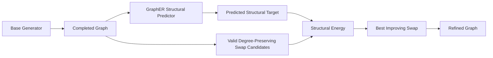

# Unified adjacency-diffusion extension

See [GRAPHER_ADJACENCY_DIFFUSION.md](GRAPHER_ADJACENCY_DIFFUSION.md) for the new joint typed molecular mode, configs, and commands. Existing spectral experiments remain available.

# GraphER — Constraint-Preserving Graph Generation and Refinement

## Joint-degree checkpoint selection

Joint DH-VAE + GraphER training now retains **best joint, best clustering histogram,
best orbit, and last** checkpoints with epoch-matched degree exports. The default
`checkpoint.pt` remains best joint; losses and guidance weights are unchanged.
See [setup, commands, integrity checks and comparisons](GRAPHER_JOINT_MULTICHECKPOINT.md).


**GraphER** is a research and engineering project for **graph generative modeling**.

It investigates a practical question:

> **Can we improve the higher-order structure of a generated graph without destroying the properties the base generator already gets right?**

GraphER starts from a **completed graph produced by a base generator**, predicts desirable structural summaries, and refines the graph through **valid double-edge swaps**. Each accepted move preserves the graph's indexed degree sequence and can enforce additional hard constraints such as simplicity and connectivity.

The project combines ideas from **generative AI, graph neural networks, constrained search, discrete optimization, diffusion-style structural guidance, and reproducible ML systems engineering**.

---

## Portfolio Highlights

This repository demonstrates experience in:

- **Generative AI research** for structured and discrete data
- **Graph neural networks** and permutation-invariant graph representations
- **Diffusion / bridge-inspired generative modeling**
- **Constrained combinatorial optimization**
- **PyTorch model design and training**
- **Research-to-code implementation**
- **ML benchmarking and reproducible experimentation**
- Integration of research baselines such as **DiGress, DeFoG, GraphRNN, and DH-VAE**
- **Molecular graph generation** with atom/bond constraints
- **Performance optimization**, including incremental graphlet updates and candidate filtering
- Experiment provenance, deterministic splits, checksums, manifests, isolated environments, and audit reports

---

## What GraphER Does

Given a completed graph \(G_0\), GraphER operates inside the degree-preserving state space

\[
\Omega(d^{(0)}) =
\left\{
G:
G \text{ is simple and connected, and }
d_v(G)=d_v(G_0)\ \forall v
\right\}.
\]

A valid double-edge swap changes two edges while preserving every node degree.

Before accepting a move, GraphER rejects candidates that would introduce:

- self-loops,
- duplicate edges,
- disconnected graphs, or
- previously visited states.

Therefore, every accepted correction preserves node count, edge count, indexed node degree, degree multiset, simplicity, undirectedness, and connectivity.

These are **hard properties of the transition operator**, not learned penalties.

---

## Core Idea

GraphER separates **what a graph should look like structurally** from **how to reach that structure under hard invariants**.

The main structural target is

\[
\Phi(G)=\bigl(H_{3:5}(G),\ C(G),\ O_{0:14}(G)\bigr),
\]

where:

- \(H_{3:5}\): connected induced graphlet histograms,
- \(C(G)\): clustering-coefficient histogram,
- \(O_{0:14}(G)\): 15-dimensional mean orbit-count vector.

The predictor estimates a target structural state, while a constrained search procedure selects valid rewiring operations that move the current graph toward that target.

---

## System Overview



GraphER is deliberately designed so the correction layer does **not** require access to the base model's training trajectory, diffusion states, logits, gradients, hidden states, or retraining.

This makes it useful for studying **model-agnostic post-generation correction**.

---

## Model Architecture

The active structural predictor consumes:

- current binary adjacency,
- normalized indexed node degrees,
- graph size,
- normalized rewiring time \(t/T\),
- padding masks.

It predicts:

- one Dirichlet concentration vector per graphlet size,
- an optional Beta distribution for connected-subset mass,
- a Dirichlet concentration vector for clustering,
- non-negative orbit-count predictions.

The graph-level outputs are permutation invariant.

The active generic model intentionally has **no terminal adjacency decoder, edge/no-edge prediction head, or learned edge-selection policy**.

---

## Constrained Refinement

At step \(t\), GraphER scores candidate graph transformations using a structural energy:

\[
\widehat E_t(G)=
\lambda_g D_g(H(G),\widehat H_t)
+\lambda_c D_c(C(G),\widehat C_t)
+\lambda_o D_o(O(G),\widehat O_t)
+\lambda_m D_m(\rho(G),\widehat\rho_t).
\]

For candidate action \(a\),

\[
\Delta_t(a)=
\widehat E_t(G_t)-\widehat E_t(T_a(G_t)).
\]

Only candidates with positive gain are eligible for acceptance.

This gives a **step-local improvement guarantee for the frozen prediction used in that decision**, while retaining the graph invariants enforced by the transition operator.

---

## Generative Pipelines

### 1. From-Scratch Topology Generation

```text
Degree Model
    ↓
Degree Sequence
    ↓
Randomized Connected Havel–Hakimi
    ↓
Initial Graph
    ↓
GraphER Refinement
    ↓
Generated Graph
```

### 2. Post-Generation Refinement

```text
Frozen Base Generator
    ↓
Completed Graph
    ↓
GraphER
    ↓
Structurally Refined Graph
```

Supported or scaffolded integrations include:

| Model | Role | Status |
|---|---|---|
| DH-VAE + Havel–Hakimi | Project-owned base generator | Ready |
| DiGress | External diffusion baseline | Ready |
| DeFoG | External discrete-flow baseline | Ready |
| GDSS | External score/SDE baseline | Ready |
| GraphRNN | External autoregressive baseline | Ready |
| CatFlow | External categorical-flow baseline | Corrected linear-path v2; CPU smoke-tested |
| GSDM (`gdsm` / `gsdm`) | External spectral-diffusion baseline | Implemented; CPU smoke-tested |
| EDGE | External degree-guided diffusion baseline | Implemented; native environment still requires validation |
| SPECTRE | External spectral GAN baseline | Implemented; CPU smoke-tested |
| HOG-Diff | External higher-order / bridge diffusion baseline | Ready |
| FLAGG | External baseline | Integration scaffold |

CatFlow, GSDM, EDGE, and SPECTRE setup, supported datasets, source adaptations,
separate training/generation/evaluation commands, and validation limits are in
[Source-backed baseline guide](docs/SOURCE_BACKED_BASELINES.md).
CatFlow users should first read the [path-mismatch audit and corrected commands](docs/CATFLOW_PATH_AUDIT_20260908.md).
The standalone distribution includes the four uploaded sources under `external/`,
not inside the `grapher` Python package. These workers do not train GraphER itself.

---

## Structural Guidance Variants

### Structural-Summary Predictor

Predicts graphlet, clustering, and orbit summaries directly from the current graph state.

### Spectral Guidance

Predicts the clean combinatorial-Laplacian spectrum and uses valid rewiring operations to move the graph toward a spectral target.

### Spectral + Graphlet-Logit Diffusion

Combines:

- global Laplacian-spectrum information,
- local higher-order graphlet structure.

Graphlet probabilities are represented in centered log-ratio coordinates and diffused in continuous summary space.

A coarse-to-fine schedule lets spectral information dominate early while graphlet structure becomes more influential near the clean endpoint.

---

## Molecular Graph Generation

GraphER also contains an attributed molecular generation path for datasets such as **QM9** and **ZINC**.

The revised molecular rewiring kernel preserves exactly:

- atom categories,
- indexed ordinary degrees,
- global bond-type counts.

It may select two bonds of different types and reassign those two bond types
across either double-edge reconnection. Per-node typed degrees and weighted
valence can therefore change locally; atom-specific valence and RDKit checks
serve as validity constraints instead of treating those quantities as hard
invariants. The previous same-bond-type kernel remains available as a strict
ablation.

The attributed spectral–graphlet model combines:

- unweighted topology spectrum,
- bond-order-weighted spectrum,
- attributed graphlet logits.

Candidate graphlets are updated using a **stateful local-delta cache**, while RDKit sanitization is restricted to a shortlisted set of promising candidates.

For molecular ring-focused experiments, set
`graphlet_topology_filter: simple_cycle`. This retains only chordless induced
cycles, uses direct bounded-degree ring enumeration and dihedral attributed
canonicalization, and keeps a background coordinate for all non-ring subsets.
See [`docs/CYCLE_ONLY_GRAPHLET_GUIDANCE.md`](docs/CYCLE_ONLY_GRAPHLET_GUIDANCE.md)
and
[`configs/experiments/grapher/qm9_attributed_spectral_cycle_graphlet.yaml`](configs/experiments/grapher/qm9_attributed_spectral_cycle_graphlet.yaml).

---

## Engineering Highlights

### Unified Baseline Interface

External generators use a common API:

```python
train(request: TrainRequest) -> TrainingArtifacts
generate(request: GenerateRequest) -> GenerationArtifacts
```

This enables heterogeneous graph generators to be trained, sampled, serialized, and evaluated under one GraphER-facing contract.

### Reproducible Artifact Management

Experiments record:

- resolved configuration,
- training and generation seeds,
- dataset identity,
- graph-batch hashes,
- source-pool hashes,
- pairing metadata,
- matching costs,
- runtime diagnostics,
- evaluation metrics,
- correction statistics.

### Base-to-Target Matching

Completed base outputs are paired with target graphs using:

- exact node-count strata,
- Hungarian matching over normalized sorted-degree profiles.

Higher-order metrics such as graphlets, clustering, and orbit counts are deliberately **excluded from the matching cost**, so they remain genuine prediction targets.

### Incremental Structural Computation

Candidate graphlet and orbit statistics use exact switch-local delta updates rather than full recomputation where possible.

This matters because constrained graph generation may evaluate many candidate rewiring operations per generation step.

---

## Repository Structure

```text
configs/
    datasets/
    experiments/

docs/
    TOPOLOGY_GENERATOR.md
    ATTRIBUTED_SPECTRAL_GRAPHLET_DIFFUSION.md
    HOG_DIFF_WRAPPER.md
    DESIGN_CONTRACT.md
    IMPLEMENTATION_AUDIT.md

scripts/
    prepare_generic_dataset.py
    train_degree_generator.py
    train_topology_grapher.py
    run_topology_grapher.py
    run_digress_baseline.py
    run_graphrnn_baseline.py
    run_defog_baseline.py
    run_hog_diff_baseline.py
    evaluate_graph_generation_report.py
    evaluate_generated_molecules.py

src/grapher/
    models/
    rewiring_mlp/
        generic/
        attributed/
        core/
        molecular/
        evaluation/

tests/
```

---

## Quick Start

### Environment

```bash
python3 -m venv .venv
source .venv/bin/activate

python -m pip install --upgrade pip
python -m pip install torch numpy networkx pyyaml matplotlib
python -m pip install pytest ruff
```

Python 3.10+ is recommended.

Optional molecular workflows additionally use RDKit, PyG, and `fcd-torch`.

### Example: Community-small

Prepare the dataset:

```bash
PYTHONPATH=src python scripts/prepare_generic_dataset.py \
  --dataset community_small \
  --root outputs/datasets
```

Train the project-owned DH-VAE + Havel–Hakimi base:

```bash
PYTHONPATH=src python scripts/run_dhvae_hh_baseline.py \
  --dataset community_small \
  --num-samples 1024 \
  --training-estimate-count 1024 \
  --seed-id 42 \
  --device gpu
```

Train GraphER:

```bash
PYTHONPATH=src python scripts/train_topology_grapher.py \
  --config configs/experiments/grapher/community_small_topology_graphlet.yaml \
  --output-dir outputs/topology_grapher/community_small/seed_42 \
  --seed 42 \
  --device gpu
```

Generate refined graphs:

```bash
PYTHONPATH=src python scripts/run_topology_grapher.py \
  --config configs/experiments/grapher/community_small_topology_graphlet.yaml \
  --output-dir outputs/topology_generation/community_small/seed_42 \
  --num-generate 1024 \
  --seed 42 \
  --device gpu
```

Evaluate:

```bash
PYTHONPATH=src python scripts/evaluate_graph_generation_report.py \
  --config configs/experiments/grapher/community_small_topology_graphlet.yaml \
  --generated-dir outputs/topology_generation/community_small/seed_42 \
  --output-dir outputs/topology_grapher/community_small/seed_42/evaluation
```

---

## Evaluation

Generic graph experiments support:

- Degree MMD
- Clustering MMD
- Orbit MMD
- graphlet statistics
- connectivity
- correction coverage
- accepted swaps
- runtime per graph
- invariant-preservation diagnostics

Molecular evaluation additionally supports:

- molecular validity,
- corrected validity,
- uniqueness,
- novelty,
- FCD when the compatible backend is installed,
- saved valid SMILES.

---

## Research Questions Explored

GraphER is being used to study:

1. **Can a completed graph be structurally improved without retraining the base generator?**
2. **How much higher-order structure can be changed while preserving an exact degree sequence?**
3. **Can structural guidance transfer across heterogeneous graph generators?**
4. **Do graphlet, clustering, orbit, or spectral targets provide the most useful correction signal?**
5. **How should global spectral information and local motif information be combined during generation?**
6. **Can expensive graph statistics be updated locally after rewiring rather than recomputed from scratch?**
7. **How useful are informative graph priors compared with random or empirical initializations?**

---

## Why This Project Is Interesting

Many graph generative models produce an adjacency matrix directly. GraphER explores a different perspective:

> **Generate or obtain a reasonable graph first, then navigate a constrained graph space to improve selected structural properties.**

This decomposition separates:

- invariant structure from higher-order structure,
- generation from correction,
- learned prediction from exact combinatorial constraints,
- base-model quality from refinement quality.

It also creates a framework for experimenting with **discrete diffusion, diffusion bridges, structural priors, graph rewiring, and constrained generative modeling**.

---

## Current Limitations

GraphER is a research prototype rather than a production graph-generation library.

Current limitations include:

- exact degree preservation means a poor degree sequence cannot be repaired by rewiring,
- finite graphlet/orbit summaries do not uniquely determine an adjacency matrix,
- some targets may be unreachable inside a fixed degree fibre,
- finite candidate budgets may miss improving moves,
- dense pair features have \(O(n^2)\) memory/computation,
- exact graphlet counting limits scalability on larger graphs,
- the greedy corrector does not imply convergence to the data distribution.

These limitations are part of the research problem and are tracked explicitly.

---

## Reproducibility

Paper-facing experiments use fixed dataset splits and multiple model seeds.

The repository separates:

- dataset preparation,
- baseline training,
- baseline generation,
- GraphER training,
- GraphER correction,
- evaluation

into independently auditable stages.

Generated outputs and correction reports retain provenance linking each refined batch to the corresponding raw graph batch.

---

## About This Project

GraphER is part of my PhD research in **Generative AI for Graphs**.

The project reflects my interests in:

- deep generative models,
- graph machine learning,
- diffusion and bridge processes,
- combinatorial optimization,
- ML systems engineering,
- reproducible scientific computing.

I am particularly interested in **research engineering, generative AI, graph ML, and research-to-code projects**.

---

## Documentation

For implementation details, see:

- [`docs/TOPOLOGY_GENERATOR.md`](docs/TOPOLOGY_GENERATOR.md)
- [`docs/ATTRIBUTED_SPECTRAL_GRAPHLET_DIFFUSION.md`](docs/ATTRIBUTED_SPECTRAL_GRAPHLET_DIFFUSION.md)
- [`docs/DESIGN_CONTRACT.md`](docs/DESIGN_CONTRACT.md)
- [`docs/IMPLEMENTATION_AUDIT.md`](docs/IMPLEMENTATION_AUDIT.md)
- [`docs/GRAPHRNN_WRAPPER.md`](docs/GRAPHRNN_WRAPPER.md)
- [`docs/DIGRESS_WRAPPER.md`](docs/DIGRESS_WRAPPER.md)
- [`docs/DEFOG_WRAPPER.md`](docs/DEFOG_WRAPPER.md)

---

## License

Add the appropriate open-source license before public release.


## Prepare molecular datasets

mkdir -p data/qm9

wget --content-disposition \
  -O data/qm9/uncharacterized.txt \
  https://ndownloader.figshare.com/files/3195404

wget -O data/qm9/gdb9.tar.gz \
  https://deepchemdata.s3-us-west-1.amazonaws.com/datasets/gdb9.tar.gz

tar -xzf data/qm9/gdb9.tar.gz -C data/qm9

PYTHONPATH=src python scripts/prepare_qm9_dataset.py \
  --config configs/datasets/qm9.yaml \
  --source sdf \
  --sdf-file data/qm9/gdb9.sdf \
  --uncharacterized-file data/qm9/uncharacterized.txt \
  --root outputs/datasets

# Draw a reproducible random sample from the prepared attributed dataset.
PYTHONPATH=src python scripts/draw_dataset.py \
  --dataset qm9_attributed \
  --dataset-root outputs/datasets \
  --split test \
  --count 16 \
  --seed 42 \
  --row 3 \
  --col 4 \
  --output outputs/qm9_test_random_16.png

# One PDF containing 64 pages of random valid molecules, followed by typed
# C3-C5 graphlet drawings. Counts use valid molecules from train+val+test.
# Each class preserves atom types, bond types, and their ring arrangement;
# equivalent rotations and reflections are grouped. All observed classes are
# drawn with element labels and bond types, up to six graphlets per page.
# Molecular graphs must pass RDKit sanitization; exclusions are reported.
# --count must not exceed the valid pool. --all draws every valid molecule.
# Counts are also saved to outputs/qm9_random_1024_graphlet_histogram.json.
PYTHONPATH=src python scripts/draw_dataset.py \
  --dataset qm9_attributed \
  --dataset-root outputs/datasets \
  --split all \
  --count 1024 \
  --seed 42 \
  --row 4 \
  --col 4 \
  --k-min 3 \
  --k-max 5 \
  --output outputs/qm9_random_1024.pdf

# Draw generated graphs directly from the same pickle passed to evaluation.
# Molecular panels and typed C3-C5 counts use raw-valid molecules from the full
# generated file: direct RDKit sanitization, without inferred charges or bond
# correction. No prepared reference dataset or evaluation run is needed.
# Replace --all with --count 1024 for a random sample (if 1024 are valid).
# Graphlet counts always cover the full valid input pool, regardless of --count.
PYTHONPATH=src python scripts/draw_generated_dataset.py \
  --generated-graphs "$GEN/molecular_graphs.pkl" \
  --dataset qm9_attributed \
  --all \
  --seed 42 \
  --row 4 --col 4 \
  --k-min 3 --k-max 5 \
  --output "$GEN/generated_drawings.pdf"

# --dataset is an optional label/hint; generic graphs also work automatically.
# A *_drawing.json file records selected original file indices and exclusions;
# *_graphlet_histogram.json records typed-cycle counts and frequencies.
# PNG and separate --graphlet-output exports work as in draw_dataset.py.

# Draw valid generated molecules that are farthest from the training set in
# both ChemNet (FCD mean term) and NSPDK feature space. Higher panel scores
# mean farther; the adjacent JSON file records full-precision scores.
PYTHONHASHSEED=0 PYTHONPATH=src python scripts/draw_generated_qm9_outliers.py \
  --generated-dir outputs/attributed_grapher/<run>/seed_42 \
  --dataset qm9_attributed \
  --dataset-root outputs/datasets \
  --split train \
  --ranking joint \
  --count 16 \
  --row 4 \
  --col 4 \
  --fcd-device gpu \
  --output outputs/qm9_generated_outliers.png

# The same command automatically uses a node-link view for generic graphs.
PYTHONPATH=src python scripts/draw_dataset.py \
  --dataset community_small \
  --dataset-root outputs/datasets \
  --split test \
  --count 8 \
  --seed 42 \
  --row 2 \
  --col 4 \
  --output outputs/community_small_test_random_8.png

# Draw every Community-small graph (train, validation, and test) over pages.
PYTHONPATH=src python scripts/draw_dataset.py \
  --dataset community_small \
  --dataset-root outputs/datasets \
  --split all \
  --all \
  --row 4 \
  --col 5 \
  --k-min 3 \
  --k-max 5 \
  --output outputs/community_small_all.png

# Draw every Ego-small graph in the same way.
PYTHONPATH=src python scripts/draw_dataset.py \
  --dataset ego_small \
  --dataset-root outputs/datasets \
  --split all \
  --all \
  --row 4 \
  --col 5 \
  --k-min 3 \
  --k-max 5 \
  --output outputs/ego_small_all.png

# Supplying both --k-min and --k-max also creates an induced-cycle graphlet
# drawing for each cycle (C3 through C5 here), labeled with count and frequency,
# sorted from highest to lowest frequency. Counts always use train+val+test,
# independently of --split, --count, --seed, or --all used for graph drawings.
# The historical _graphlet_histogram filename is retained for compatibility.
# The commands above respectively write:
#   outputs/community_small_all_graphlet_histogram.{png,json}
#   outputs/ego_small_all_graphlet_histogram.{png,json}
# Only node-induced subgraphs that are exactly a simple cycle are counted;
# chorded cycles and subgraphs with branches or disconnected nodes are omitted.

PYTHONPATH=src python scripts/prepare_zinc_dataset.py \
  --config configs/datasets/zinc.yaml \
  --smiles-file data/zinc250k.csv \
  --smiles-column smiles \
  --root outputs/datasets

export DEFOG=/home/quang/DeFoG
export DEFOG_PYTHON=/home/quang/miniconda3/envs/defog/bin/python

PYTHONPATH=src python scripts/run_defog_baseline.py \
  --dataset community_small \
  --num-samples 1024 \
  --seed-id 42

## Minimal spectral diffusion + clustering histogram experiment

The optional clean local-clustering histogram head and histogram-guided rewiring are documented in
[`GRAPHER_CLUSTERING_HISTOGRAM.md`](GRAPHER_CLUSTERING_HISTOGRAM.md). The new experiment is
`configs/experiments/grapher/community_small_topology_spectral_clustering_histogram.yaml`.
It uses 100 normalized bins, a softmax head and CDF loss, and spectral + histogram-W1
candidate scoring. Existing scalar-clustering configs/checkpoints retain their behavior.


## Orbit-dominant clustering + orbit debug configuration

The new `community_small_topology_spectral_clustering_histogram_orbit_dominant.yaml`
keeps joint spectral/histogram/orbit training unchanged and uses generation weights
clustering=0.25, orbit=1.0, spectrum=0.0. Existing joint checkpoints can be reused.
The graph report evaluator now supports `--reference-split val|test`; use validation
for guidance selection. See [GRAPHER_ORBIT_DOMINANT.md](GRAPHER_ORBIT_DOMINANT.md)
for installation, checkpoint reuse, optional training, generation, evaluation,
performance options, and reporting compatibility notes.

### Cycle-only graphlet summary (k=3)

The spectral-input debug predictor can additionally learn a two-bin triangle
occurrence histogram and use it in degree-preserving rewiring, alongside the
clustering histogram and orbit summary. See
[GRAPHER_CYCLE3_SUMMARY.md](GRAPHER_CYCLE3_SUMMARY.md) for the exact normalization,
limits, checkpoint requirements, diagnostics, and training/generation/evaluation
commands. The new config is
`configs/experiments/grapher/community_small_topology_spectral_clustering_orbit_cycle3.yaml`.


## Joint degree-conditioned GraphER

The optional `community_small_topology_joint_degree.yaml` experiment embeds the
ordinary DH-VAE in GraphER, shares degree encoder/decoder features with the spectral
summary predictor, and enforces nine necessary degree/orbit identities. Generation
uses the degree model in the selected joint checkpoint. See
[GRAPHER_JOINT_DEGREE.md](GRAPHER_JOINT_DEGREE.md) for warm-start requirements,
training/generation/evaluation commands, ablations, and limitations. Existing
separate-model configurations remain supported.

Joint training covers edge counts up to the simple-graph bound implied by the
DH-VAE's existing node and degree limits, even when validation graphs have more
edges than any training graph. Warm-start checkpoints with a smaller edge head
are expanded automatically: learned conditioning and existing logits are
preserved, and new edge classes start with at most `1e-6` total probability per
supported graph size. Empirical distributions still use only training graphs.
The expansion is logged and saved in the training report and joint checkpoint;
the training command and component checkpoint paths need no changes.

## Joint typed prior and soft bond diffusion (new attributed family)

See [GRAPHER_JOINT_TYPED_EDGE.md](GRAPHER_JOINT_TYPED_EDGE.md) for the new
joint typed-DH-VAE + symmetric soft edge-logit bridge, indexed source/target
alignment, independent checkpoint selections, and same-bond-type constrained
realization. The new QM9/ZINC configs are `*_attributed_joint_typed_edge.yaml`.
Legacy generic and attributed model families remain available unchanged.

## Full induced-graphlet summaries

See [GRAPHER_INDUCED_GRAPHLETS.md](GRAPHER_INDUCED_GRAPHLETS.md) for exact k=3/4/5 topology histograms, prediction and guidance in generic/joint-degree and joint typed-edge GraphER, catalogue definitions, compatibility requirements, and commands. The new default k=5 experiment uses all 34 connected and disconnected classes; cycle experiments remain unchanged.

Joint typed-edge runs with `induced_graphlet_attributed: true` first fit an exact
atom-and-bond-labeled vocabulary on the training split. This is CPU preprocessing;
`--device gpu` selects the device for model training. With `scope: all`, fitting
includes every induced k-node subset, including disconnected ones. Canonical
patterns are cached in memory during the process. Add
`--progress-interval-seconds 10` to `scripts/train_attributed_grapher.py` to report
graphs/subsets processed, observed bins, elapsed time, and estimated time remaining
during fitting. This also controls training progress reports. Fitting additionally
reports every 1,000 graphs; use `--graphlet-progress-interval 1` for every graph.
Reports include the last graph's index, size, time, new bins, recent throughput,
and canonicalization cache hits/misses. Workload and training stage logs identify
dataset loading, model initialization, split validation, endpoint setup, batch
loading/computation, and checkpoint writing. Vocabulary fitting always reports
the first and final graph; set both progress intervals to zero to disable periodic
fitting reports.


## Empirical degree perturbations (Community-small)

Generation-only options `unit_transfer`, `moment_preserving`, `edge_relocation`,
and `interpolation` are available through
`generation.degree_source=train_empirical_perturbed`. All preserve node/edge
counts; moment-preserving blocks also preserve the squared-degree sum.
See [the protocol and per-option commands](docs/degree_perturbation_community_small.md).
A new independently seeded empirical control, prior-only coverage diagnostic,
three-seed runner, and provenance-checked metric summarizer are included.
