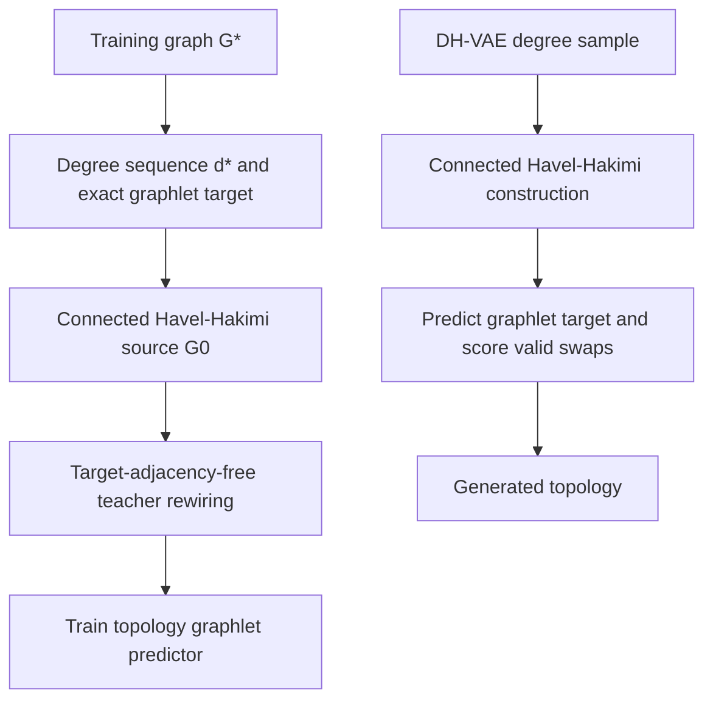

# GraphER: Decoupled Topology Generation

GraphER is a constraint-preserving graph generator/refiner. The maintained
generic routes either construct a graph from a learned degree sequence or use
a frozen DeFoG sample as the base, then apply valid double-edge rewiring.

This release implements the first part of the decoupled design: generic graph
topology generation. It does not predict node labels, edge labels, edge
occupancy, or a no-edge category in the active topology path.

## Current scope

The intended topology-attribute factorization is

\[
p(A,X,R)=p_{\mathrm{top}}(A)\,
         p_{\mathrm{attr}}(X,R\mid A),
\]

where \(A\) is the unlabelled topology, \(X\) contains node attributes, and
\(R\) contains edge attributes. The current implementation provides
\(p_{\mathrm{top}}\):

\[
p_{\mathrm{top}}(A,d)
=p_\eta(d)\,p_\theta(A\mid d).
\]

- \(p_\eta(d)\): DH-VAE samples an ordinary degree sequence.
- A connected Havel-Hakimi constructor realizes the sampled sequence.
- \(p_\theta(A\mid d)\): a topology predictor estimates the target
  connected-graphlet law, and GraphER rewires within the fixed degree fibre.

| Route | Status | Active implementation |
| --- | --- | --- |
| Generic topology | Current | DH-VAE + connected Havel-Hakimi + graphlet-only GraphER |
| Generic post-hoc correction | Current baseline | frozen DeFoG + graphlet-only GraphER |
| Attributed endpoint model | Legacy compatibility | Existing QM9/ZINC code under `grapher.rewiring_mlp.attributed` |
| Decoupled attribute stage | Planned | Attribute-only CatFlow/DeFoG-style process conditioned on generated topology |

The DH-VAE and topology predictor are currently trained as separate modules and
composed during generation. End-to-end joint optimization is not implemented.

## Baseline model wrappers

The post-generation evaluation requires every frozen base generator to expose
the same GraphER-facing interface. The new `grapher.models` package registers
wrappers for DH-VAE + randomized Havel--Hakimi, DiGress, CatFlow, DeFoG,
HOG-Diff, and FLAGG. Each wrapper has the common methods:

```python
train(request: TrainRequest) -> TrainingArtifacts
generate(request: GenerateRequest) -> GenerationArtifacts
```

This is an experiment-orchestration and reporting refactor. It does not change
the GraphER predictor, candidate swaps, validity constraints, or correction
rule.

Wrappers are located in `src/grapher/models/`, rather than a top-level
`src/models/`, so that GraphER remains namespaced and does not shadow external
repositories that use imports such as `models.*`. The package contains adapters
for third-party baselines and the complete project-owned DH-VAE+HH baseline.
Third-party model code remains in its own pinned repository and environment.

| Wrapper ID | Model | Wrapper status | Intended backend |
| --- | --- | --- | --- |
| `dhvae_hh` | DH-VAE + randomized HH | Ready: generic, QM9, and ZINC | Project-owned trainer, invariant sampler, and exact constructor |
| `digress` | DiGress | Placeholder | Isolated external repository |
| `catflow` | CatFlow | Placeholder | Isolated external repository |
| `defog` | DeFoG | Ready: generic, QM9, and ZINC | Isolated training plus schema-validated neutral-NPZ generation |
| `hog_diff` | HOG-Diff | Placeholder | Isolated external repository |
| `flagg` | FLAGG | Placeholder | Isolated external repository with recorded filler configuration |

Unimplemented third-party integrations raise `BaselineNotImplementedError`
before creating partial artifacts. The DH-VAE, samplers, HH constructors,
trainer, diagnostics, and ready common wrapper live together under
`grapher.models.dhvae_hh`; the existing training/evaluation CLI paths remain
as compatibility entry points.

Baseline outputs use a single collision-resistant layout:

```text
outputs/baselines/<model>/<dataset>/<training-run>/
├── run.json
├── train/
│   ├── manifest.json
│   ├── resolved_config.yaml
│   ├── train.log
│   ├── native_dataset/
│   ├── training_estimates/
│   │   ├── estimated_graphs.pkl
│   │   ├── ground_truth_graphs.pkl
│   │   ├── ground_truth_model_view.pkl  # molecular runs when required
│   │   ├── manifest.json
│   │   └── native/
│   └── checkpoints/
└── generations/<generation-run>/
    ├── base_graphs.pkl
    ├── manifest.json
    ├── generate.log
    └── native/
```

Training and generation seeds are distinct. The default identifiers are
`seed_<training-seed>` and `seed_<generation-seed>_n_<sample-count>`, so several
raw batches can be generated from one checkpoint without overwriting each
other. GraphER-corrected graphs belong under a separate `outputs/corrections/`
tree and must reference the raw batch hash and order in their manifest.

Dataset references distinguish the benchmark name, GraphER serialized name,
and upstream-native alias. For example, Community-small may be represented by
`community_small` in reports, `sbm` in the current prepared-data directory, and
`comm20` in DeFoG. The report-facing benchmark name is always used in the
baseline artifact path.

The complete API, manifest requirements, and implementation checklist are in
[`docs/BASELINE_MODEL_WRAPPERS.md`](docs/BASELINE_MODEL_WRAPPERS.md).
The DeFoG-specific setup, training-estimate semantics, and examples are in
[`docs/DEFOG_WRAPPER.md`](docs/DEFOG_WRAPPER.md).

To train DH-VAE+HH on Community-small and generate 1,024 raw graphs:

```bash
PYTHONPATH=src python scripts/run_dhvae_hh_baseline.py \
  --dataset community_small \
  --num-samples 1024 \
  --seed-id 42
```

The command trains the DH-VAE from `outputs/datasets/sbm`, realizes sampled
degree sequences with the existing randomized connected HH constructor, and
writes the raw batch to
`outputs/baselines/dhvae_hh/community_small/seed_42/generations/seed_42_n_1024/base_graphs.pkl`.
The optional post-training estimate pool is an independent unconditional
sample, so its manifest records `pairing.status: unpaired` and retains an exact
copy of the training split instead of asserting index alignment.

To train DeFoG on the prepared Community-small split and then generate 1,024
raw graphs, keep GraphER in its own environment and point the wrapper at the
isolated DeFoG interpreter:

```bash
export DEFOG=/home/quang/DeFoG
export DEFOG_PYTHON=/home/quang/miniconda3/envs/defog/bin/python

PYTHONPATH=src python scripts/run_defog_baseline.py \
  --dataset community_small \
  --num-samples 1024 \
  --seed-id 42
```

For a one-GPU run, the training worker replaces DeFoG's hard-coded DDP strategy
with Lightning's single-device strategy, so NCCL is not initialized merely to
train on one device. The worker prints its effective strategy and writes
`train/runtime_diagnostics.json`. If training fails, the complete log,
diagnostics, Hydra configuration, command, and failure classification remain
under `outputs/baselines/defog/<dataset>/<run-id>/failures/attempt-*/` even
after the temporary staging directory is removed.

## Design overview



### Degree-constrained state space

After construction assigns the sampled degrees to indexed nodes, GraphER stays
inside

\[
\Omega(d^{(0)})=
\left\{
G:
G\text{ is simple and connected, and }
d_v(G)=d_v^{(0)}\ \forall v
\right\}.
\]

A valid double-edge swap selects two edges with four distinct endpoints and
replaces them by one of the two cross-connections. Before scoring, GraphER
rejects actions that introduce a self-loop, duplicate edge, disconnected
state, or previously visited state.

Every accepted action therefore preserves:

- node and edge counts;
- each indexed node's ordinary degree;
- the degree multiset;
- simplicity and undirectedness;
- absence of self-loops and parallel edges; and
- connectivity.

These are hard guarantees of the transition operator, not learned penalties.

### Connected graphlet target

For each maintained graphlet size \(k\in\{3,4,5\}\), the implementation
uses the complete basis of connected, unlabelled, induced graphlets. If
\(c_H(G)\) is the number of induced occurrences of graphlet \(H\), the
per-size composition is

\[
h_k(G)_H=
\frac{c_H(G)}
{\sum_{J\in\mathcal K_k}c_J(G)}.
\]

The optional connected-subset mass is

\[
\rho_k(G)=
\frac{\sum_{H\in\mathcal K_k}c_H(G)}
{\binom{|V|}{k}}.
\]

Graphlet counts are exact. Candidate counts are obtained with exact
switch-local deltas over subsets affected by the removed or inserted edges.
The `graphlet_backend: sampled` field in maintained YAML files applies to
standalone evaluation, not to topology training or candidate scoring.

### State-conditioned predictor

`TopologyGraphletPredictor` consumes:

- the current binary adjacency \(A_t\);
- normalized indexed node degrees;
- graph size;
- normalized rewiring time \(t/T\); and
- node/pair padding masks.

It produces one Dirichlet concentration vector \(\alpha_{t,k}\) per graphlet
size and one optional Beta pair \((a_{t,k},b_{t,k})\) for connected mass:

\[
\widehat h_{t,k}
=\frac{\alpha_{t,k}}{\sum_j\alpha_{t,k,j}},
\qquad
\widehat\rho_{t,k}
=\frac{a_{t,k}}{a_{t,k}+b_{t,k}}.
\]

The graph-level output is permutation invariant. The model has no terminal
node head, pair/edge head, no-edge class, pair loss, degree-consistency loss, or
learned selector. It does use dense symmetric pair features internally, so the
current encoder still has \(O(n^2)\) pair memory/computation.

The topology loss is

\[
\mathcal L_{\mathrm{top}}
=\lambda_{\mathrm{mean}}\,
  \mathrm{CE}(h^\star,\widehat h)
+\lambda_{\mathrm{dist}}\,
  [-\log\operatorname{Dir}(h^\star;\alpha)]
+\lambda_{\mathrm{mass}}\,
  [-\log\operatorname{Beta}(\rho^\star;a,b)].
\]

All maintained generic configurations use weights
`graphlet_mean: 1.0`, `graphlet_distribution: 0.1`, and
`graphlet_mass: 0.0`. The mass head exists, but it is not trained or used by
the maintained experiments.

### Teacher trajectories

For each terminal training graph \(G^\star\), the teacher:

1. extracts its ordinary degree sequence and one exact graphlet target;
2. constructs and optionally randomizes a connected Havel-Hakimi realization;
3. proposes ordinary valid double-edge swaps without reading the terminal
   adjacency;
4. scores candidates against the cached graphlet target;
5. follows a hard or soft distribution over positive-improvement actions; and
6. emits `STOP` when the target tolerance is met or no proposed valid action
   improves the target discrepancy.

The same cached target supervises all selected states from that trajectory.
Teacher actions create informative intermediate states and are retained for
diagnostics, but they are not used to train a selector in the current generic
path.

### Generation and correction energy

At generation step \(t\), one predicted target is frozen while all proposed
candidates are compared:

\[
\widehat E_t(G)
=
\frac{1}{|\mathcal K|}
\sum_k
\left\|h_k(G)-\widehat h_{t,k}\right\|_2
+\lambda_m
\frac{1}{|\mathcal K|}
\sum_k
\left|\rho_k(G)-\widehat\rho_{t,k}\right|.
\]

For candidate action \(a\),

\[
\Delta_t(a)
=\widehat E_t(G_t)
-\widehat E_t(T_a(G_t)).
\]

Only candidates with \(\Delta_t(a)>\varepsilon\) can be accepted. The
maintained greedy configuration chooses the best improving candidate and
recomputes the graphlet prediction after every accepted swap.

This gives a step-local decrease guarantee for the frozen prediction used in
that decision. It does not imply global monotonicity, exact target recovery, or
convergence to the data distribution because the predicted target changes
after each accepted swap.

## Repository layout

```text
configs/
  datasets/                    Generic and molecular dataset definitions
  experiments/dhvae/           Degree-prior training configurations
  experiments/grapher/         Topology and retained attributed configurations
docs/
  DHVAE_HH_PACKAGE.md          DH-VAE+HH isolation boundary and migration map
  TOPOLOGY_GENERATOR.md        Detailed topology data flow and guarantees
  DESIGN_CONTRACT.md           Proposal-to-implementation contract
scripts/
  defog_export_worker.py
  defog_prepare_dataset_worker.py
  defog_prepare_molecular_dataset_worker.py
  defog_molecular_runtime.py
  defog_train_worker.py
  prepare_generic_dataset.py
  train_degree_generator.py
  evaluate_degree_generator.py
  train_topology_grapher.py
  run_topology_grapher.py
  run_defog_grapher.py
  evaluate_graph_generation_report.py
src/grapher/rewiring_mlp/       Rewiring MLP implementation and support code
  generic/                      Generic structural-summary corrector
  attributed/                   Attribute-aware corrector
  core/                         Shared degree-preserving swap operations
  molecular/                    Molecular constraints and typed invariants
  evaluation/                   Raw/corrected metrics and study utilities
src/grapher/models/dhvae_hh/    DH-VAE, samplers, HH constructors, and CLIs
src/grapher/models/defog.py     Common DeFoG train/generate wrapper
src/grapher/models/defog_backend.py
                                Isolated subprocess and neutral-export boundary
src/grapher/models/defog_molecular_codec.py
                                Strict QM9/ZINC semantic graph codec
tests/                          Generic and retained legacy regression tests
```

## Environment setup

Python 3.10 or newer is required. This archive does not contain packaging
metadata, so run it with `PYTHONPATH=src` and install dependencies directly.

```bash
python3 -m venv .venv
source .venv/bin/activate
python -m pip install --upgrade pip

# Install a CUDA-specific PyTorch build instead when required by your machine.
python -m pip install torch
python -m pip install numpy networkx pyyaml matplotlib

# Development and verification tools.
python -m pip install pytest ruff
```

Optional dependencies:

- ORCA: exact external four-node orbit evaluation.
- RDKit, PyG, and `fcd-torch`: retained molecular workflows only.

Run every command below from the repository root.

## End-to-end quick start: Community-small

### 1. Prepare and freeze the dataset

```bash
PYTHONPATH=src python scripts/prepare_generic_dataset.py \
  --dataset community_small \
  --root outputs/datasets
```

Community-small intentionally retains the historical serialized name `sbm`.
Its files are therefore written to `outputs/datasets/sbm/`.

### 2. Train the DH-VAE degree prior

```bash
PYTHONPATH=src python scripts/train_degree_generator.py \
  --config configs/experiments/dhvae/community_small.yaml
```

The maintained generation configuration samples graph size from the empirical
training distribution and samples the degree histogram conditional on that
size.

Optional prior diagnostic:

```bash
PYTHONPATH=src python scripts/evaluate_degree_generator.py \
  --config configs/experiments/dhvae/community_small.yaml \
  --num-samples 1024 \
  --max-reference-sequences 20
```

The standalone evaluator reports both raw-prior and accepted-prior results. Its
accepted stream retains the older repair-capable postprocessing behavior.
Strict end-to-end topology generation is instead enforced by the topology
configuration with `postprocess_policy: reject_only` and `fallback: error`.
Use the raw-prior fields when diagnosing native DH-VAE feasibility.

### 3. Train the topology graphlet predictor

```bash
PYTHONPATH=src python scripts/train_topology_grapher.py \
  --config configs/experiments/grapher/community_small_topology_graphlet.yaml \
  --output-dir outputs/topology_grapher/community_small/seed_42 \
  --seed 42
```

This command writes the best validation checkpoint. It does not load or update
the DH-VAE checkpoint.

### 4. Generate graph topologies

```bash
PYTHONPATH=src python scripts/run_topology_grapher.py \
  --config configs/experiments/grapher/community_small_topology_graphlet.yaml \
  --checkpoint outputs/topology_grapher/community_small/seed_42/checkpoint.pt \
  --output-dir outputs/topology_grapher/community_small/seed_42/generated \
  --num-generate 1024 \
  --seed 42
```

The topology configuration points to
`outputs/degree_generators/sbm/seed_42/checkpoint.pt`. Generation fails early
if either checkpoint is missing or incompatible.

For each requested graph, the script retries degree sampling plus construction
up to `generation.max_attempts_per_graph`. If one graph exhausts that budget,
the run raises an error and does not save a partial collection.

### 5. Evaluate saved graphs

```bash
PYTHONPATH=src python scripts/evaluate_graph_generation_report.py \
  --config configs/experiments/grapher/community_small_topology_graphlet.yaml \
  --generated-dir outputs/topology_grapher/community_small/seed_42/generated \
  --output-dir outputs/topology_grapher/community_small/seed_42/evaluation
```

The standalone report compares training, Havel-Hakimi source, and final
topology distributions using degree, clustering, and four-node orbit MMD. It
also writes representative graph figures. It does not currently report
graphlet-history MMD; graphlet discrepancy appears in training/generation
diagnostics.

## Prepare report-facing molecular datasets

Canonical QM9 preparation requires the original `gdb9.sdf` and the official
`uncharacterized.txt` distributed with QM9. The command verifies 133,885 source
records, excludes exactly 3,054 declared uncharacterized records, audits
unsupported charge/stereo state, and writes the fixed 130,831-molecule split:

```bash
PYTHONPATH=src python scripts/prepare_qm9_dataset.py \
  --config configs/datasets/qm9.yaml \
  --source sdf \
  --sdf-file data/qm9/gdb9.sdf \
  --uncharacterized-file data/qm9/uncharacterized.txt \
  --root outputs/datasets
```

Prepare the fixed ZINC-12k subset from a local ZINC250k SMILES table. This
protocol retains aromatic source bonds, rejects unsupported charged atoms, and
records source and selected-record hashes:

```bash
PYTHONPATH=src python scripts/prepare_zinc_dataset.py \
  --config configs/datasets/zinc.yaml \
  --smiles-file data/zinc250k.csv \
  --smiles-column smiles \
  --root outputs/datasets
```

Both commands print the same preparation-summary schema and write immutable
`train.pkl`, `val.pkl`, and `test.pkl` artifacts plus resolved configuration
and machine-readable preparation reports.

## DeFoG base + GraphER correction

The DeFoG adapter runs in a subprocess so DeFoG can retain its own legacy
Python/Lightning/PyG environment. Set `DEFOG` to the DeFoG repository root. If
that environment uses a different interpreter, also set `DEFOG_PYTHON`:

```bash
export DEFOG=/absolute/path/to/DeFoG
export DEFOG_PYTHON=/absolute/path/to/defog/environment/bin/python

PYTHONPATH=src python scripts/run_defog_grapher.py \
  --config configs/experiments/grapher/community_small_defog_corrector.yaml \
  --defog-checkpoint /absolute/path/to/comm20.ckpt \
  --checkpoint outputs/topology_grapher/community_small/seed_42/checkpoint.pt \
  --output-dir outputs/defog_grapher/community_small/seed_42 \
  --num-generate 1024 \
  --seed 42
```

The child calls DeFoG's `GraphDiscreteFlowModel.sample_batch()` directly; it
does not invoke DeFoG's test-metric or visualization path. Samples are exported
as numeric `defog_samples.npz` arrays with `allow_pickle=False` and decoded
according to the recorded dataset schema. Generic batches are checked for a
simple symmetric adjacency, a zero diagonal, one node class, and preserved
sample order. QM9 and ZINC batches are checked against their dataset-specific
atom and bond vocabularies and converted to NetworkX graphs with
`atomic_num`/`atom_type` and `bond_type`/`bond_order` attributes intact.

To reuse identical DeFoG samples across correction ablations, set
`base_generator.generated_path` to a previous `defog_samples.npz`. A raw DeFoG
`.pkl` is also accepted through the isolated worker, but it must be trusted in
the same way as a model checkpoint because Pickle loading can execute code.

Disconnected DeFoG samples are retained unchanged under
`disconnected_policy: no_op_and_report`; they are not dropped, connected, or
replaced by their largest component. The common wrapper supports
Community-small through DeFoG's `comm20` profile and Ego-small through the same
explicitly recorded generic compatibility profile; the report-facing identity
and artifact path remain `ego_small`. Grid has no declared compatible profile.
The attached DeFoG revision also supports heavy-atom QM9 (`dataset=qm9`, default
experiment `qm9_no_h`) and ZINC (`dataset=zinc`, experiment `zinc`). ZINC uses
DeFoG's verified Kekule model representation, so generated bond classes are
1--3 rather than an explicit aromatic class. The fixed ZINC preparation
protocol rejects molecules containing any formally charged atom because that
state is not represented by DeFoG; regenerate older prepared ZINC splits after
updating this repository. No generated molecule is silently filtered or
repaired.

Evaluate the paired source/final sets with the same report script:

```bash
PYTHONPATH=src python scripts/evaluate_graph_generation_report.py \
  --config configs/experiments/grapher/community_small_defog_corrector.yaml \
  --generated-dir outputs/defog_grapher/community_small/seed_42
```

This reports `defog_base_to_test` rather than mislabelling the base set as a
Havel-Hakimi source. A released DeFoG `comm20` checkpoint uses DeFoG's own
SPECTRE split; the run report records this provenance and must not claim an
identical GraphER training split unless DeFoG was retrained accordingly.

## Other generic datasets

Use the same five-stage workflow with the corresponding names:

| Benchmark | Prepare with `--dataset` | DH-VAE config | Topology config | Configured degree checkpoint |
| --- | --- | --- | --- | --- |
| Community-small | `community_small` | `configs/experiments/dhvae/community_small.yaml` | `configs/experiments/grapher/community_small_topology_graphlet.yaml` | `outputs/degree_generators/sbm/seed_42/checkpoint.pt` |
| Ego-small | `ego_small` | `configs/experiments/dhvae/ego_small.yaml` | `configs/experiments/grapher/ego_small_topology_graphlet.yaml` | `outputs/degree_generators/ego_small/seed_42/checkpoint.pt` |
| Grid | `grid` | `configs/experiments/dhvae/grid.yaml` | `configs/experiments/grapher/grid_topology_graphlet.yaml` | `outputs/degree_generators/grid/seed_42/checkpoint.pt` |

Suggested topology output roots are:

- `outputs/topology_grapher/community_small/seed_42`
- `outputs/topology_grapher/ego_small/seed_42`
- `outputs/topology_grapher/grid/seed_42`

Grid uses `topology_predictor.batch_size: 1` because exact graphlet extraction
and dense pair representations are substantially more expensive for its larger
graphs.

## Configuration reference

| Section | Purpose | Important maintained settings |
| --- | --- | --- |
| `pipeline` | Select active route | `stage: topology` |
| `dataset` | Split name, root, and config | `build_if_missing: false` |
| `graphlet_prediction` | Target basis/counting | connected, exact, \(k=3,4,5\) |
| `topology_trajectory` | Teacher construction | 12 steps, 96 proposals, 24 valid candidates, 4 retained states |
| `topology_predictor` | Model and optimizer | graphlet-only losses, best validation checkpoint |
| `generation` | Degree source and requested yield | learned prior, 1024 graphs, 8 outer attempts |
| `degree_generator` | DH-VAE loading/sampling | empirical size, reject-only, no fallback |
| `constructor` | Initial realization | connected Havel-Hakimi |
| `topology_refiner` | Candidate selection | 24 steps, 128 proposals, 32 valid candidates, greedy positive-gain selection |
| `evaluation` | Saved-set metrics | degree/clustering/orbit MMD and sample figures |
| `base_generator` | Optional external base | isolated DeFoG checkpoint/export and sampling settings |

### Degree-source ablations

`generation.degree_source` supports:

- `learned`: strict DH-VAE sampling; the maintained default;
- `empirical`: sample a degree sequence from the training distribution; and
- `oracle`: reuse held-out test degree sequences for diagnostic
  error decomposition only.

Oracle mode is not a generative result and must be labelled explicitly.

### Topology checkpoint contract

Topology checkpoints use format `topology_graphlet_predictor_v1` and include:

- model weights and architecture;
- the complete graphlet basis and coordinate order;
- graphlet summary configuration;
- validation metrics; and
- the resolved experiment configuration.

Legacy endpoint checkpoints are intentionally rejected rather than partially
loaded.

## Output files

| Stage | Default location | Files |
| --- | --- | --- |
| Dataset preparation | `outputs/datasets/<serialized-name>/` | `train.pkl`, `val.pkl`, `test.pkl`, `resolved_dataset_config.yaml`, `metadata.json`, `prep_report.json` |
| DH-VAE training | Beside configured degree checkpoint | `checkpoint.pt`, `degree_vectorizer.json`, `training_metrics.json` |
| DH-VAE evaluation | Configured evaluation directory | `degree_evaluation.json`, `generated_degree_sequences.json` |
| Topology training | `--output-dir` or checkpoint parent | `checkpoint.pt`, `training_report.json` |
| Generation | `--output-dir` | `coarse_graphs.pkl`, `topology_refined_graphs.pkl`, `report.json` |
| DeFoG correction | `--output-dir` | `defog_samples.npz`, `defog_manifest.json`, `defog.log`, `defog_base_graphs.pkl`, `topology_refined_graphs.pkl`, `report.json` |
| Standalone evaluation | `--output-dir` | `graph_mmd_metrics.csv`, `graph_evaluation_report.json`, `generated_graph_samples.png`, `generated_graph_samples.pdf` |

Maintained topology configurations do not write the old
`hybrid_refined_graphs.pkl` alias.

## Diagnostics

`training_report.json` records:

- best epoch and validation loss;
- per-epoch graphlet losses and MAE;
- graphlet basis coordinates;
- initial/final teacher graphlet discrepancy;
- accepted teacher steps and STOP rate; and
- teacher proposal and valid-candidate statistics.

Generation `report.json` records:

- raw DH-VAE graphicality and connected feasibility;
- internal sampling attempts, repair/fallback flags, and outer retries;
- constructor and final degree fidelity;
- connectedness rate;
- proposal/pass counts and rejection reasons;
- accepted swaps and frozen-target graphlet gains;
- predictor validation graphlet MAE;
- STOP behavior; and
- per-graph and total runtime.

Do not replace missing topology diagnostics with endpoint fields such as pair
NLL, pair F1, or sampled-endpoint feasibility. Those quantities do not exist in
the active generic model.

## Guarantees and limitations

- GraphER cannot repair a poor sampled degree sequence because every accepted
  swap preserves it. Degree-distribution error primarily diagnoses DH-VAE.
- Connected Havel-Hakimi is not a uniform sampler over \(\Omega(d)\).
- Strict rejection changes the effective accepted invariant distribution, so
  report raw feasibility, attempts, rejection, constructor yield, and final
  quality separately.
- A finite graphlet law does not identify a unique adjacency.
- Exact candidate scoring is performed only within the sampled candidate set;
  finite proposal budgets can miss improving swaps.
- `STOP` means no positive move among the proposed valid unvisited
  candidates, or no candidate at all. It does not mean exact reconstruction.
- Connectivity masks and finite candidate budgets may restrict reachability
  inside a degree fibre.
- Refreshing the prediction after a swap removes any global monotonic-energy
  guarantee.
- The current greedy corrector is constrained local optimization, not an
  invariant MCMC kernel or a proof of distributional convergence.
- Exact graphlet counting and dense pair features limit scalability,
  particularly on Grid.
- The complete topology basis implementation supports small graphlet sizes;
  maintained experiments use only \(k\le5\).

## Reproducibility

- Prepare each dataset once with its fixed dataset seed and keep the split
  files unchanged across model seeds.
- Tune on validation data and evaluate the selected setting once on test data.
- Use model seeds 42, 43, and 44 for paper-facing mean and standard deviation.
- The shipped DH-VAE YAML files are configured only for seed 42, and
  `train_degree_generator.py` has no seed/output CLI override. For seeds 43
  and 44, create separate config copies and change both `seed` and
  `degree_generator.checkpoint_path`.
- Keep proposal budget, valid-candidate budget, graphlet-scoring cost, and
  accepted swaps as separate measurements.
- Label learned-, empirical-, and oracle-degree runs explicitly.
- Never aggregate topology-only and attributed results into the same row.

## Retained attributed pipeline and planned Stage 2

The repository still contains the earlier QM9/ZINC endpoint implementation for
compatibility:

- `scripts/train_hybrid_endpoint_grapher.py`
- `scripts/run_hybrid_endpoint_grapher.py`
- `configs/experiments/grapher/qm9_attributed_hybrid_endpoint_graphlet.yaml`
- `configs/experiments/grapher/zinc_attributed_hybrid_endpoint_graphlet.yaml`

That route uses typed invariants, all-pairs edge/no-edge prediction,
same-bond-type swaps, attributed graphlets, and policy/hybrid selectors. It is
not the new decoupled attribute stage.

This limitation concerns GraphER's planned topology-conditioned attribute
stage, not the baseline wrapper. `DeFoGWrapper` can train and sample
unconditional DeFoG bases for QM9 and ZINC while preserving DeFoG's supported
atom and bond attributes; it does not implement that planned conditional stage
or apply GraphER correction by itself.

The planned Stage 2 will condition an attribute-only CatFlow/DeFoG-style
process on a generated topology, omit edge-occupancy/no-edge prediction, and
optionally apply attributed-graphlet rewiring correction. No such Stage 2
training or generation script is implemented in this release.

## Verification

Generic-path checks:

```bash
PYTHONPATH=src python -m pytest -q \
  tests/test_defog_wrapper.py \
  tests/test_defog_common_wrapper.py \
  tests/test_defog_molecular_codec.py \
  tests/test_defog_molecular_dataset_worker.py \
  tests/test_topology_grapher.py \
  tests/test_degree_generator.py \
  tests/test_generic_dataset_builders.py \
  tests/test_readme_contract.py

ruff check src scripts tests
ruff format --check src scripts tests
python -m compileall -q src scripts tests
```

Run the full test suite only after installing the optional dependencies needed
by the retained molecular path:

```bash
PYTHONPATH=src python -m pytest -q
```

## Additional documentation

- [Decoupled topology generator](docs/TOPOLOGY_GENERATOR.md)
- [Implementation design contract](docs/DESIGN_CONTRACT.md)
- [Implementation audit](docs/IMPLEMENTATION_AUDIT.md)
- [Refactor notes](docs/REFACTOR_NOTES.md)
